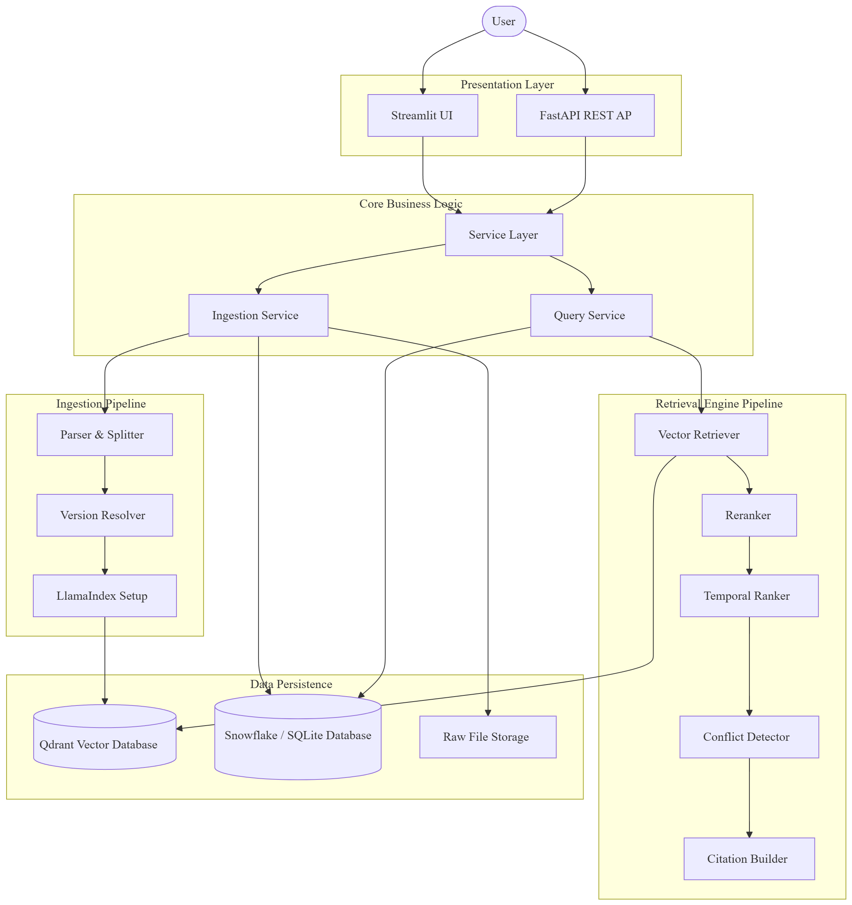
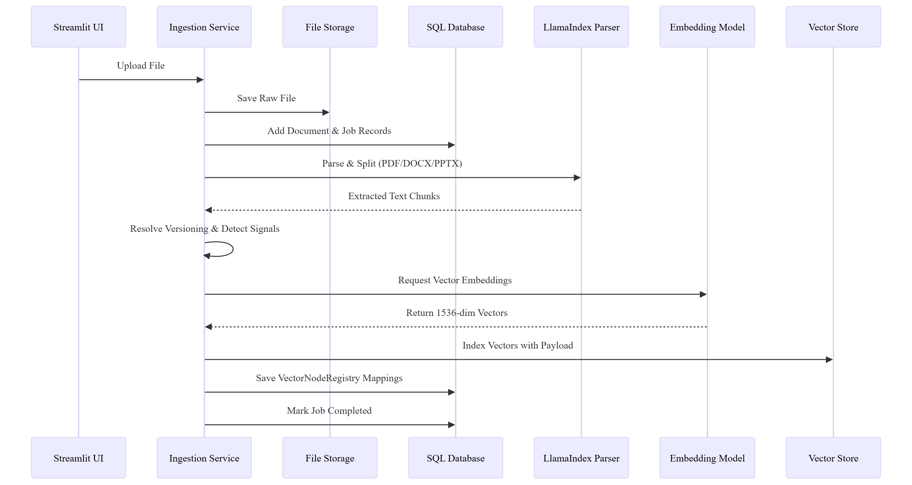
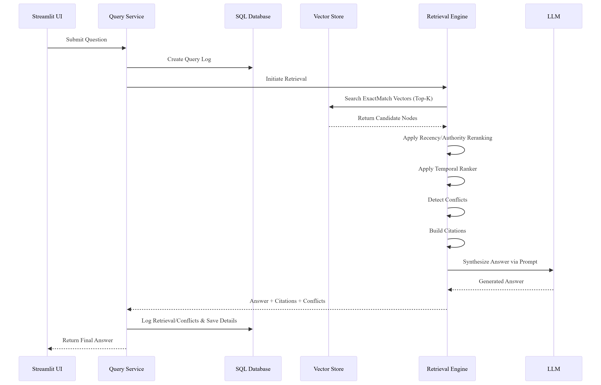

# System Architecture

## Overview

RAG System uses a monolithic Python codebase serving a Streamlit UI alongside an optional FastAPI REST service. It is designed around a shared core containing ingestion, database interaction, LlamaIndex pipelines, and retrieval logic.

## High-Level Components

- **User Interface (`ui/`, `streamlit_app.py`)**: Built with Streamlit for a stateful, interactive web application. The frontend uses an in-process adapter (`ui/lib/api.py`) to directly interface with backend Python services bypassing network-bound HTTP calls.
- **REST API (`api.py`)**: A decoupled FastAPI layer available at `/api/v1` that wraps the internal core services for programmatic usage or third-party downstream consumption.
- **Service Layer (`app/services/`)**: Orchestrates the core business flows: document ingestion pipeline (`ingest_service.py`) and RAG query execution (`query_service.py`).
- **Retrieval Engine (`app/retrieval/`)**: Implements an advanced retrieval pipeline managing multi-stage filtering, document temporal ranking, conflict detection across data sources, and citation mapping.
- **Ingestion & Indexing (`app/ingestion/`, `app/indexing/`)**: Leverages LlamaIndex for parsing and slicing documents into chunks based on semantic boundaries before embedding and tracking them within the Vector node registry.
- **Database Layer (`app/db/`)**: Relies on Snowflake (via SQLAlchemy) as the primary relational persistence system for structured metadata, user permissions, and job tracking, with local SQLite fallback for dev environments. Query states, document relationships, and VectorNode registries are all orchestrated here.
- **Vector Database**: Connects to Qdrant via the LlamaIndex orchestrator for robust, low-latency, cross-client dimension vector embeddings.

## Key Interaction Flows

### 1. Document Upload Flow

### 2. Querying Flow

1. **Document Upload**: Streamlit -> `api.upload_document` -> `ingest_service.py` -> File stored in `data/raw/` -> SQL ingestion job stored -> Parser splits and parses chunks using LlamaIndex -> Version Resolution occurs -> LLM title extracts -> OpenAI chunks indexed inside Qdrant -> Mapping tracked in SQL `VectorNodeRegistry`.
2. **Querying**: Streamlit -> `api.query` -> `query_service.py` -> `VecteraRetriever` pulls ExactMatch vectors -> Reranker scores node chunks based on temporality and authority -> `ConflictDetector` identifies numeric contradictions across files -> LLM builds prompt -> SQL logs query details.
