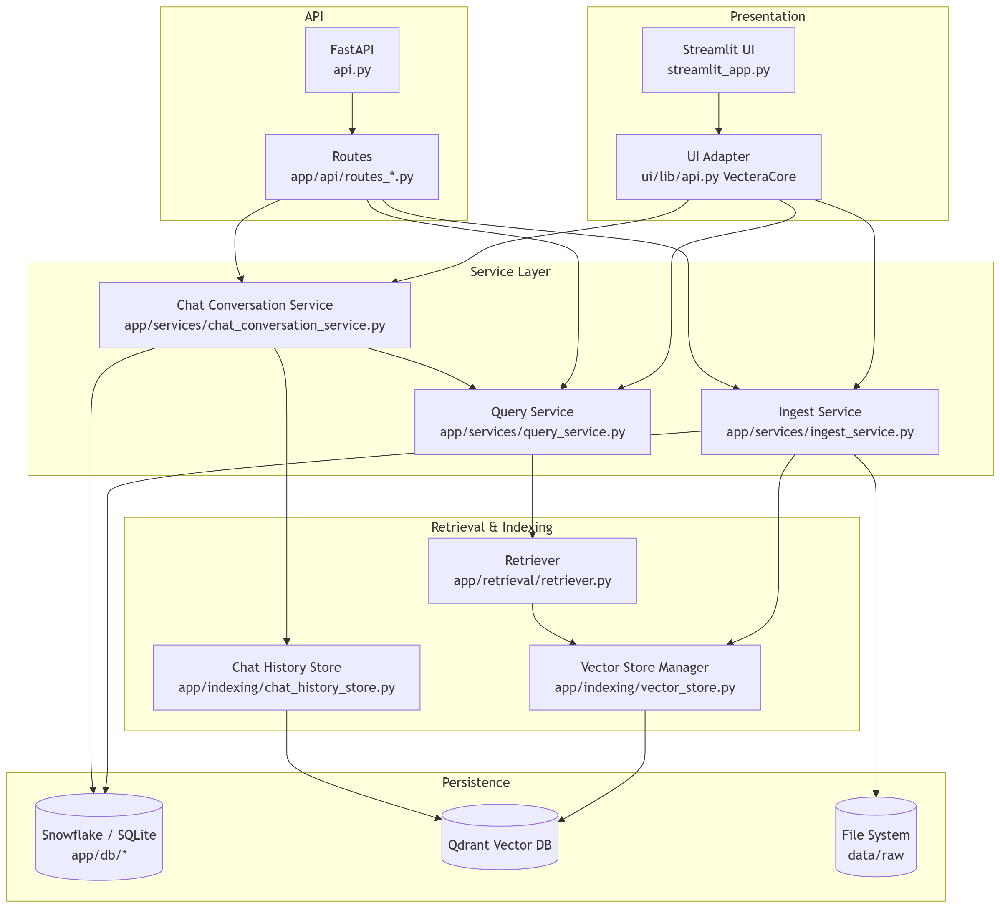
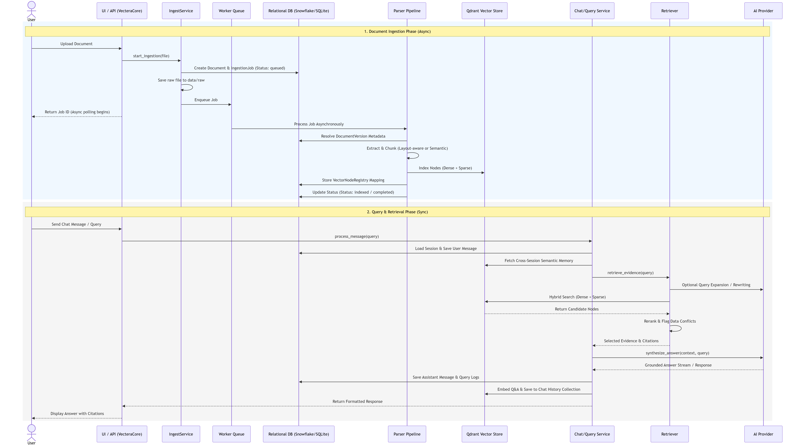

# System Architecture (Current)

## Overview

A single Python codebase with two entry points sharing one service layer:

- Streamlit UI (`streamlit_app.py`) for day-to-day operations.
- FastAPI (`api.py`) for external/programmatic access.

Both paths call the same orchestration classes/functions in `app/services/*`.

## High-Level Topology

1. Presentation
   - Streamlit pages: `ui/pages/*`
   - UI adapter: `ui/lib/api.py` (`VecteraCore`)
2. API
   - FastAPI routes: `app/api/routes_clients.py`, `routes_documents.py`, `routes_query.py`, `routes_health.py`
3. Service layer
   - Ingestion orchestration: `app/services/ingest_service.py`
     - Queue and worker management: `app/services/ingest_queue.py`
     - Metadata parsing and validation logic: `app/services/ingest_metadata.py`
   - Query orchestration: `app/services/query_service.py`
   - Session-aware chat: `app/services/chat_conversation_service.py`
   - Query history and context services: `app/services/query_history_service.py`, `chat_context_service.py`
4. Retrieval + indexing
   - Retrieval orchestration: `app/retrieval/retriever.py`
     - Evidence selection & verification: `app/retrieval/evidence_selector.py`
     - Prompt construction & contextualization: `app/retrieval/prompt_builder.py`
     - Answer generation & LLM synthesis: `app/retrieval/synthesizer.py`
   - Vector store manager: `app/indexing/vector_store.py`
   - Chat memory vector store: `app/indexing/chat_history_store.py`
5. Persistence
   - Relational models/session factory: `app/db/*`
   - Vector database: Qdrant

## Runtime Boundaries

- Streamlit does not call local REST endpoints; it calls service logic in-process via `VecteraCore`.
- REST handlers are thin wrappers over the same service-layer workflows.
- Business logic stays in `app/services/*`, not in UI pages or route handlers.

## Request + Ingestion Sequence Diagram

## Core Flows

### 1. Document Ingestion

1. Upload request creates `Document` + `IngestionJob` in queued state.
2. Raw file is persisted to `data/raw`.
3. `IngestionQueueManager` workers process jobs asynchronously.
4. Parser path — 4-level fallback chain (`app/ingestion/parser/`):
   1. **Reducto** (`external/reducto.py`) — if `ENABLE_EXTERNAL_PARSER` and `REDUCTO_API_KEY` set.
   2. **LlamaParse** (`external/llamacloud.py`) — if `ENABLE_EXTERNAL_PARSER` and `LLAMA_CLOUD_API_KEY` set.
   3. **Layout-aware PDF** (`custom/pdf_pipeline/`) — PDFs with `ENABLE_LAYOUT_AWARE_PDF`.
   4. **Legacy** (`custom/legacy.py`) — always available.
   - External parsers (1, 2) return page-delimited markdown; `to_llama_docs()` splits on
     `[[START OF PAGE n]]` / `[[END OF PAGE n]]` markers into one `LlamaDocument` per page.
   - All paths feed a single `SemanticSplitterNodeParser` + LLM enrichment pass in `ingest_service.py`.
5. Version metadata is resolved and stored in `DocumentVersion`.
6. Nodes are indexed to Qdrant; SQL mapping rows are stored in `VectorNodeRegistry`.
7. Status transitions complete (`queued` -> `processing` -> `indexed` / `failed`).

### 2. Query + Answer Generation

1. Query is executed via `ChatConversationService` (session-aware) and `execute_query`.
2. `VecteraRetriever` performs client-scoped retrieval with hybrid Qdrant search.
3. Query expansion may add rewrite variants for comparative/visual/conflict prompts.
4. Reranker applies semantic + temporal/version + structure-aware adjustments.
5. Conflict detector flags numeric disagreements across candidate evidence.
6. Citations are built from selected evidence.
7. LLM synthesis produces grounded answer (chat-completions or responses mode, by config).
8. Query/retrieval/conflict logs are persisted.

### 3. Conversation Memory

1. Chat messages are stored in SQL (`chat_sessions`, `chat_messages`).
2. Session summaries are refreshed after turns.
3. Q/A pairs are embedded into a dedicated chat-history Qdrant collection.
4. Cross-session semantic matches are injected into future query context.

### 4. Deletion and Cleanup

- Document deletion removes vectors, version rows, ingestion jobs, and raw file.
- Client deletion cascades through document/query/chat state and chat-memory vectors.

## Data and Infra Notes

- Primary relational DB is Snowflake when configured; otherwise SQLite fallback (`rag_local.db`).
- API startup ensures schema and additive compatibility columns (`ensure_runtime_schema`).
- Main Qdrant collection is configured for dense+sparse hybrid retrieval when collection shape allows it.
- Vector dimension mismatches are treated as configuration errors and may require collection recreation.

## Access Model

- Authentication and role-based authorization are removed.
- Runtime is internal single-tenant mode (`user_id` is persisted as sentinel `internal` where needed).
